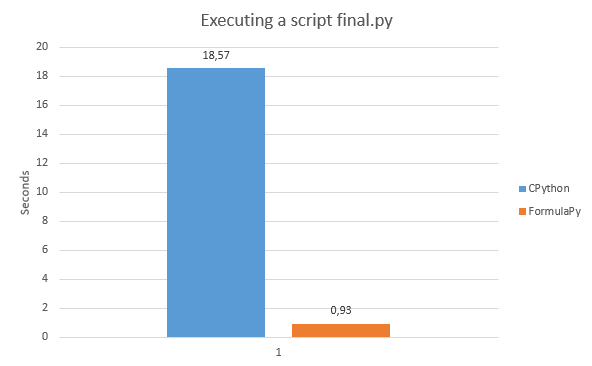
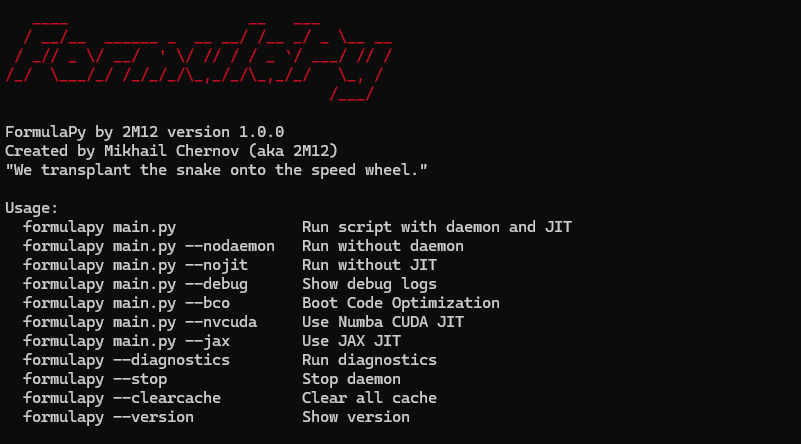
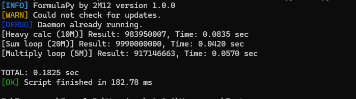

<div align="center">
  <p align="center">
    
  </p>

  <br>
  <h1>⚡ FormulaPy</h1>
  <h4>Fast Python Runtime with JIT and C++ core. Accelerates Python scripts up, and make it faster than CPython using Numba JIT, C++ code analysis, and a background daemon.</h4>

  
  
  
  
  
  
  
  
  

  <p align="center">
    
  </p>
</div>

<br>

---

> [!WARNING]
> ## 🇷🇺 Not for an English audience
> If you are a Russian audience, then read [README.md](https://github.com/2M12/FormulaPy/blob/main/README-ru.md)

## ❓ Why you need this

**Python** is slow. Very slow on loops. A simple `for` with 50 million iterations takes seconds.

<p align="center">
  
  <br><em>Benchmark: CPython vs FormulaPy (Tests folder)</em>
</p>

**FormulaPy** solves this problem. It:
- Analyzes your Python code with a C++ core
- Finds loops (`for`, `while`) and JIT-compatible functions
- Injects `@_formulapy_jit` automatically
- Compiles hot functions with Numba JIT
- Keeps Python warm with a background daemon

**Who it's for:** Python developers, data scientists, script authors, anyone who wants faster Python.

**FormulaPy does not change your code.** It works as a wrapper – you run `formulapy script.py` instead of `python script.py`.

> [!WARNING]
> ### ⚠️ Development is ongoing
> ### The tool will continue to evolve, and if anything is missing, please suggest ideas. The project may be missing something, and that's okay.
>


---

> [!CAUTION]
> ### ❗ About fake copies
> Official sources are only those that are in the profile [2M12](https://github.com/2M12/2M12/blob/main/README.md). I do not post anything on Telegram channels/groups or other sources. If you come across something outside of this repository, these are false copies that often contain malware.

> [!NOTE]
> ### ❗ Important notes
> * Speedup depends on the code: loops with pure integer operations get the biggest boost.
> * The tool is provided **as is**.
> * **Primary focus is numerical code** – strings and file I/O are not JIT-accelerated yet.
> * The first run with JIT may be slower (Numba compiles), repeated runs are much faster.
> * The daemon keeps Python and libraries in memory for instant startup.

## 🔍 Features

### ⚡ JIT Acceleration
* Automatic detection of `for` and `while` loops.
* C++ core injects `@_formulapy_jit` into suitable functions.
* Numba JIT compiles hot functions to machine code.
* Safe fallback to Python if Numba fails.

### 🧠 C++ Core (DLL)
* **Fast code parsing** – C++ replaces slow Python `ast.parse`.
* **JIT injection** – decorators inserted at C++ speed.
* **FNV-1a hashing** – quick cache keys for bytecode.
* **Version detection** – core version reporting.

### 🖥️ Daemon
* **Background process** on `127.0.0.1:8765`.
* Keeps Python and Numba imported in memory.
* Executes scripts without interpreter startup delay.
* Handles multiple connections in parallel.

### 📦 Caching
* Bytecode caching for repeated runs.
* JIT cache via Numba.
* Cache management with `--clearcache`.

### 🔧 JIT Modes
* **Numba** – CPU JIT for numerical code.
* **Numba CUDA** – GPU JIT (requires NVIDIA GPU).
* **JAX**– JAX JIT (experimental).
* **--nojit** – disable JIT entirely.

### 🔍 Diagnostics
* Checks Python version.
* Checks Core DLL availability.
* Checks daemon status.
* Checks cache directory.

## 🖼️ Screenshots

<p align="center">
  
  <br><em>Main menu – FormulaPy help</em>
</p>

<p align="center">
  
  <br><em>Running a script with JIT and daemon</em>
</p>

---

> [!WARNING]
> ### ⚠️ Limitations
> * **Does not accelerate strings and file I/O** (yet).
> * **int64 overflow** may occur with very large numbers in JIT mode.
> * **First JIT run** is slower due to compilation.
> * **GUI/COM scripts** are not JIT-compatible.
> * Virtual machines may not show speedup.

---

## 📥 Installation

### Method 1: Installer (recommended)
1. Download `FormulaPy-x86-x64-v1.0.0.zip` from [Releases](https://github.com/2M12/FormulaPy/releases).
2. Extract all files to a folder.
3. Right-click `install.bat` → "Run as administrator".
4. Follow the prompts.

The installer will:
- Install Python 3.11 if missing (via winget).
- Install dependencies (Numba, NumPy, etc.) via pip.
- Copy files to `%LOCALAPPDATA%\FormulaPy\Engine`.
- Create `formulapy` command.
- Add to PATH (optional).

### Method 2: From source
```bash
git clone https://github.com/2M12/FormulaPy.git
cd FormulaPy
pip install -r requirements.txt
python formulapy.py script.py
```

## ☑️ Checksum
formulapy.py:
```bash
MD5	30813ddc72a57c37478df32c2b7b52a9
SHA-256	37def13be42a7f0bcceafeb700569c00889e929c16ecd69faa5d04068d12d486
```
formulacore.dll:
```bash
MD5	476536e2eb3b4e427ebd7cd04d1dd288
SHA-256	630ec772d11038c84daeff268353633fe8ca2798707f8e53eb343328839490ca
```
install.bat:
```bash
MD5	50d0a25e59a6f3bbc343db3b0c5a9332
SHA-256	8cb414a5bd346d092de695e8146a9b2716194337ba57c81167050a1cf5929e12
```
## 📜 License
MIT © 2026 Mikhail (2M12)
